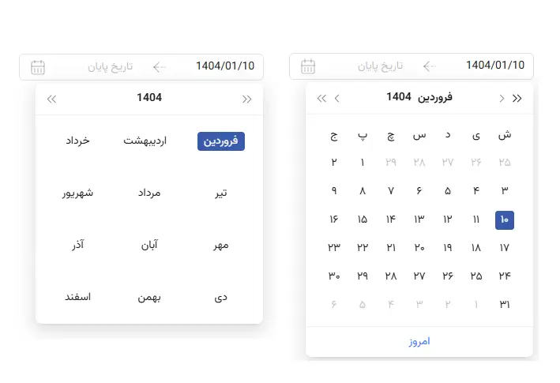

# Convert to Persian Month in Ant Design DatePicker

This function is used for Ant Design DatePicker



## Features

- Fully customized Persian month names
- Easy to use with Ant Design
- Simple API consistent with Ant Design DatePicker
- Written in TypeScript with full type definitions

## Installation

```bash
npm install convert-to-persian-month-antd
# or
yarn add convert-to-persian-month-antd
```

## Dependencies

This package has the following peer dependencies:

- react
- react-dom

## Usage

```jsx
import { DatePicker } from "antd";
import locale from "antd/es/date-picker/locale/fa_IR";
import convertToPersianMonths from "convert-to-persian-month";

<DatePicker locale={convertToPersianMonths(locale)} format="YYYY/MM/DD" />;
```

## Example

```jsx
import { ConfigProvider, DatePicker } from "antd";
import dayjs from "dayjs";
import jalaliday from "jalaliday";
import locale from "antd/es/date-picker/locale/fa_IR";
import convertToPersianMonths from "convert-to-persian-month-antd";

dayjs.extend(jalaliday);
dayjs.calendar("jalali");

const PersianDatePicker = ({ onChange, ...props }) => {
  return (
    <ConfigProvider direction="rtl">
      <DatePicker
        locale={convertToPersianMonths(locale)}
        format="YYYY/MM/DD"
        onChange={(date) => {
          console.log(date.format("YYYY/MM/DD"));
        }}
        {...props}
      />
    </ConfigProvider>
  );
};

export default PersianDatePicker;
```

## License

MIT
